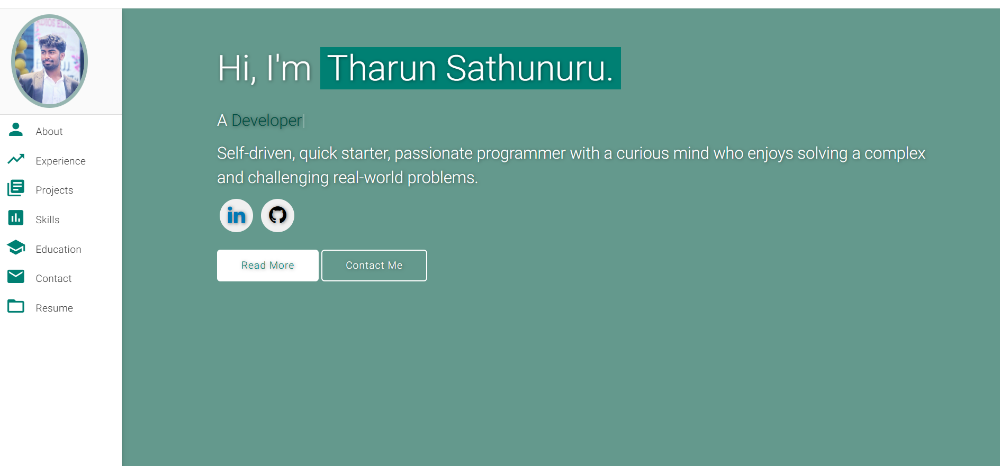

🚀 Personal Portfolio Website

A clean, modern, and responsive Personal Portfolio Website built to showcase my skills, projects, and experience as a Software Developer.

🌐 Live Website:
👉https://personalportfolio-sepia-one.vercel.app/

📸 Website Preview

  

✨ Features

✅ Fully Responsive Design
✅ Modern UI & Smooth Animations
✅ Typing Animation using Typed.js
✅ Easy Customization
✅ Clean and Structured Code
✅ GitHub Pages Deployment Ready

📚 Sections Included
👨‍💻 About Me
💼 Experience
🚀 Projects
🧠 Skills
🎓 Education
📄 Resume
📬 Contact Information
🛠️ Built With
HTML5
CSS3
JavaScript
Materialize CSS
Typed.js
GitHub Pages
⚙️ Installation & Setup

Follow these steps to run locally:

# Clone repository
git clone https://github.com/Tharun-301/personal-portfolio.git

# Open folder
cd portfolio

# Open index.html in browser
🚀 Deployment (GitHub Pages)
Create a repository named:
your-username.github.io
Push your portfolio code:
git add .
git commit -m "Initial portfolio deployment"
git push origin main
Go to:
Settings → Pages → Deploy from Branch → main

✅ Your portfolio will be live at:

https://Tharun-301.github.io

You can easily modify:

index.html → Personal details
assets/img → Images & profile photo
assets/resume → Resume PDF
Social media links
Projects section
⭐ Support

If you like this project:

⭐ Star the repository
🍴 Fork it
📢 Share it

📬 Contact Me
LinkedIn: https://www.linkedin.com/in/tharun-sathunuru-3a773026b
GitHub: https://github.com/Tharun-301
Email: tharunsathunuri@gmail.com
